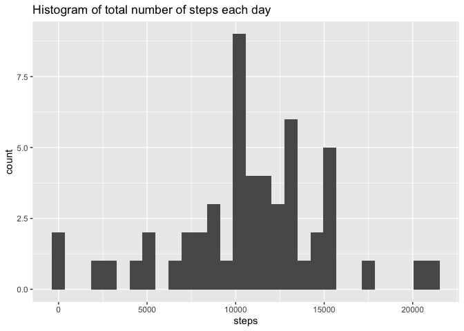
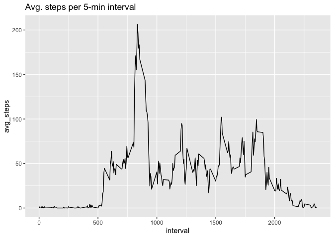
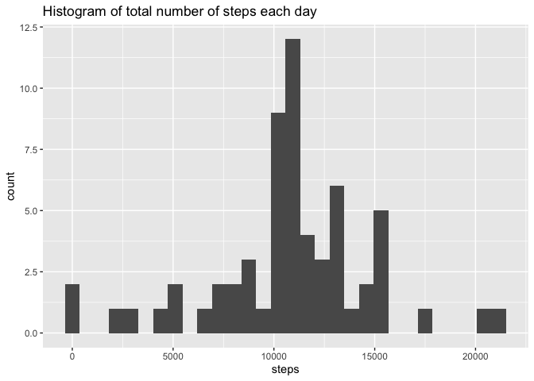
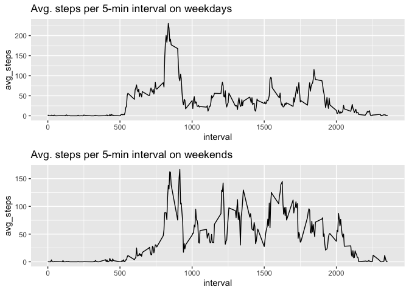

## Code chunk options


```r
knitr::opts_chunk$set(message = FALSE)
```


## Libraries


```r
library(data.table)
library(tidyverse)
library(gridExtra)
```


## Loading the data

We'll use a Bash command to unzip the data from the URL. This may not work if you are using Windows.

```r
dt = fread("curl https://d396qusza40orc.cloudfront.net/repdata%2Fdata%2Factivity.zip | funzip")
```


## What is the mean total number of steps taken per day?

Remove missing values:

```r
dt_noNA = drop_na(dt)
```
1. Calculate the total number of steps taken per day

```r
steps_per_day = summarise(group_by(dt_noNA, date), steps=sum(steps))
```

2. Make a histogram of the total number of steps taken each day

```r
ggplot(data = steps_per_day) + geom_histogram(mapping = aes(steps)) +
    labs(title = "Histogram of total number of steps each day")
```

<!-- -->

3. Calculate and report the mean and median of the total number of steps taken per day

```r
mean(steps_per_day$steps)
```

```
## [1] 10766.19
```

```r
median(steps_per_day$steps)
```

```
## [1] 10765
```


## What is the average daily activity pattern?

1. Make a time series plot of the 5-minute interval (x-axis) and the average number of steps taken, averaged across all days (y-axis)

```r
steps_per_int = summarise(group_by(dt_noNA, interval), avg_steps=mean(steps))
ggplot(data = steps_per_int) + 
    geom_line(mapping = aes(interval, avg_steps)) +
    labs(title = "Avg. steps per 5-min interval")
```

<!-- -->

2. Which 5-minute interval, on average across all the days in the dataset, contains the maximum number of steps?

```r
steps_per_int$interval[which.max(steps_per_int$avg_steps)]
```

```
## [1] 835
```

## Imputing missing values

1. Calculate and report the total number of missing values in the dataset (i.e. the total number of rows with NAs)

```r
sum(is.na(dt))
```

```
## [1] 2304
```

2. Devise a strategy for filling in all of the missing values in the dataset. The strategy does not need to be sophisticated. For example, you could use the mean/median for that day, or the mean for that 5-minute interval, etc.

**We'll replace it using the mean for that 5-minute interval.**

3. Create a new dataset that is equal to the original dataset but with the missing data filled in.

```r
imputed = dt
imputed$steps = unsplit(tapply(dt$steps, dt$interval,
    function(x) {x[is.na(x)] = mean(x[!is.na(x)]); return(x)}), dt$interval)
```

4. Make a histogram of the total number of steps taken each day and calculate and report the mean and median total number of steps taken per day. Do these values differ from the estimates from the first part of the assignment? What is the impact of imputing missing data on the estimates of the total daily number of steps?

```r
imputed_per_day = summarise(group_by(imputed, date), steps=sum(steps))
ggplot(data = imputed_per_day) + geom_histogram(mapping = aes(steps)) +
    labs(title = "Histogram of total number of steps each day")
```

<!-- -->

```r
mean(imputed_per_day$steps)
```

```
## [1] 10766.19
```

```r
median(imputed_per_day$steps)
```

```
## [1] 10766.19
```

**The mean number of steps per day is the same as the mean with NAs excluded from the first part of the assignment. The median number of steps per day is very close to the median from the first part and is now the same as the mean. The histogram appears roughly the same as the first part, but with higher counts because days which were previously excluded from the data are now included.**


## Are there differences in activity patterns between weekdays and weekends?

1. Create a new factor variable in the dataset with two levels – “weekday” and “weekend” indicating whether a given date is a weekday or weekend day.

```r
imputed$day_of_wk = substr(weekdays(as.Date(imputed$date)),1,1)
imputed$day_type = factor(sapply(imputed$day_of_wk,
    function(x) {if (x=="S") {y="weekend"} else {y="weekday"}; return(y)}))
```

2. Make a panel plot containing a time series plot of the 5-minute interval (x-axis) and the average number of steps taken, averaged across all weekday days or weekend days (y-axis).

```r
weekday_steps = summarise(group_by(filter(imputed, day_type=="weekday"), interval), avg_steps=mean(steps))
weekend_steps = summarise(group_by(filter(imputed, day_type=="weekend"), interval), avg_steps=mean(steps))
p1 = ggplot(data = weekday_steps) + 
    geom_line(mapping = aes(interval, avg_steps)) +
    labs(title = "Avg. steps per 5-min interval on weekdays")
p2 = ggplot(data = weekend_steps) + 
    geom_line(mapping = aes(interval, avg_steps)) +
    labs(title = "Avg. steps per 5-min interval on weekends")
grid.arrange(p1, p2, nrow = 2)
```

<!-- -->
